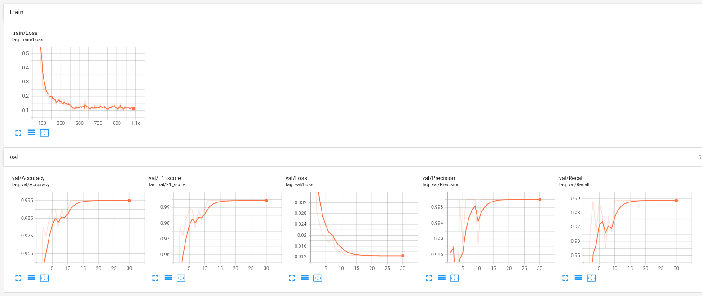
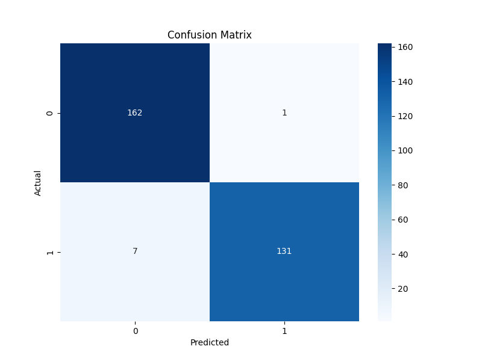
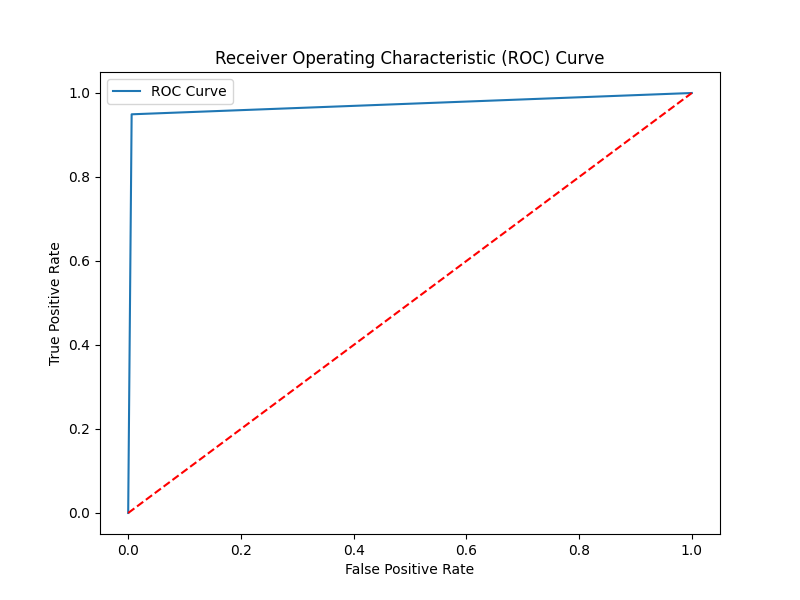
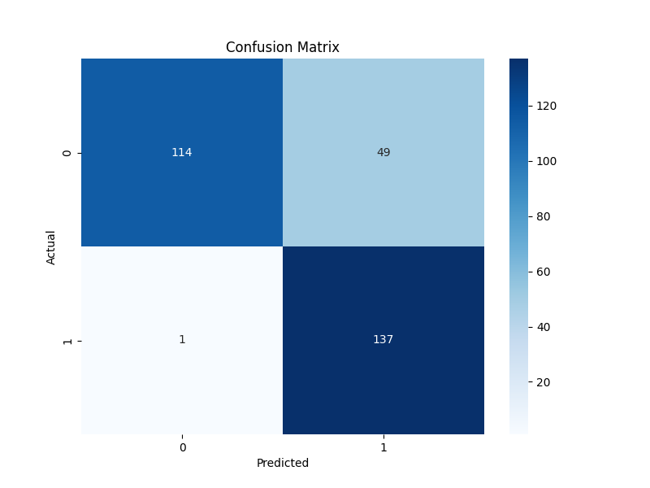
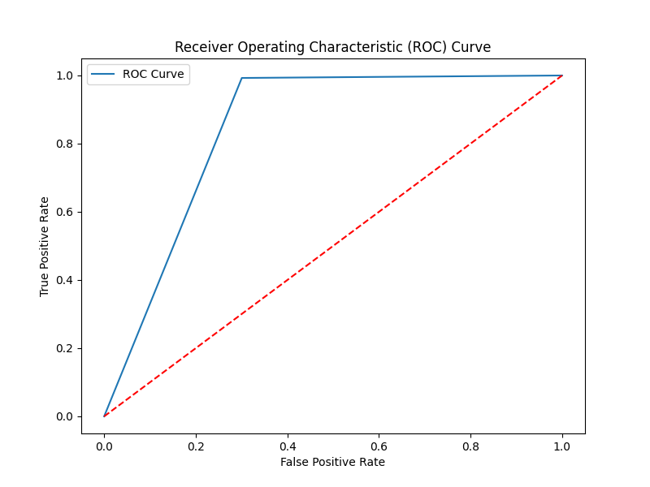

# Overlapping Voices Classifier

This repository contains a model for classifying overlapping voices using features extracted from the Whisper model.

## Requirements

To install the necessary dependencies, run:

```
pip install -r requirements.txt
```

## Preprocessing

### Dataset

1. **Create a Dataset:**
   Download a file containing speech audios and music audios. Use the \`data_aug.py\` script to create a version containing instrumental background music:

   ```
   python utils/data_aug.py --input_dir=dataset_audios --output_dir=dataset_dir --instrumental_dir=instrumental_dir --sr=16000
   ```

2. **Convert Audio Samples to 16k Sample Rate:**
   
   ```
   python utils/convert_sr.py --input_dir=dataset_dir --output_dir=dataset_dir16 --sr=16000 --force
   ```

### Extract Whisper Embeddings

To extract Whisper embeddings:

```
python utils/extract_features.py --input_dir=dataset_dir16 --output_dir=dataset_features --model_name=whisper-medium
```

Available models:

- `whisper-tiny`
- `whisper-base`
- `whisper-small`
- `whisper-medium`
- `whisper-large`

### Create File Lists

Create three files: `train_files.csv`, `test_files.csv`, and `val_files.csv`, containing the list of files and their labels:

```csv
filename1.pt,label1
filename2.pt,label2
filename3.pt,label3
```

Use label \`0\` for clean speech and label \`1\` for speech with music.

## Training

1. **Check the Configuration:**
   Verify the parameters in the \`configs/config_whisper.json\` file.

2. **Start Training:**
   
   ```
   python train.py --config=configs/config_whisper.json
   ```

### Checkpoints

Checkpoints are available at:

- [Whisper Medium Simple](gs://vai-ml/models/music_background_classifier/whisper-medium-simple.tar.bz)
- [Whisper Medium](gs://vai-ml/models/music_background_classifier/whisper-medium.tar.bz)

Training logs can be visualized as shown below:



### Results

Results of the training process using `whisper_dense`:

<p align="center">
  
  
</p>

Results of the training process using `whisper_dense_simple`:

<p align="center">
  
  
</p>

## Inference

To run inference with the trained model:

```
python test.py --config=configs/config_whisper.json --resume=./checkpoints/model_best.pth
```

---

This README provides a clear and structured overview of the repository, making it easier for users to understand the requirements, preprocessing steps, training process, and inference procedure.
